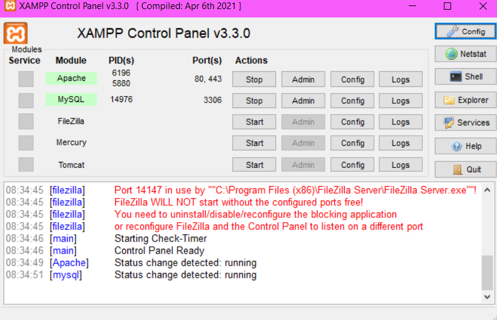
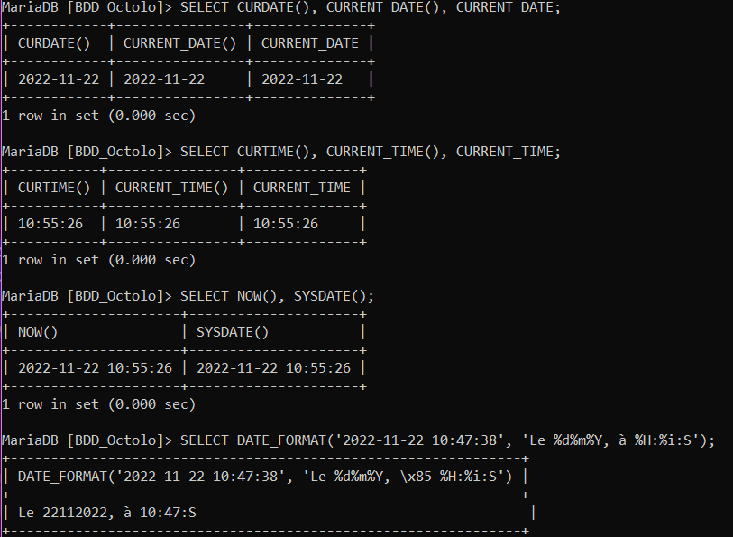
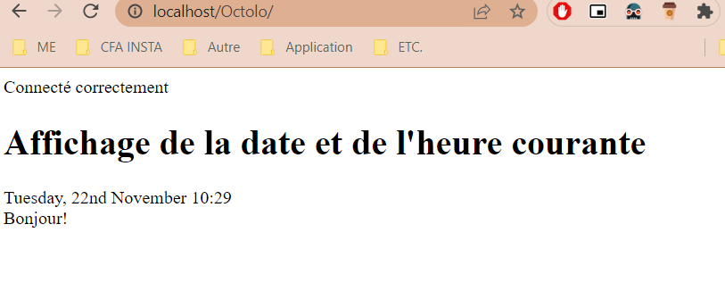

# DATE & HEURE
********

## Afficher la date et l'heure:
*******
- Afficher dans un front la date et l'heure courante.
- L'information devra être récoltée sur un backend et maintenue à jour.
- Sauvegarde sous git public pour le check.

## Tecnologie utilisée :
*******
PHPMyAdmin
XAMPP
PHP
Mysql

## Comment l'installer ?
Si l'administrateur crée votre base de données pour vous lors de la configuration, vous pouvez commencer à l'utiliser :
``
DROP DATABASE IF EXISTS BDD_Octolo;
``

``
CREATE DATABASE BDD_Octolo;
``

`` 
USE BDD_Octolo;
``
Vous retrouverez la create table se trouve dans le BDD_Octolo.sql

## XAMPP
*******
Je me suis connecté avec XAMPP version 8.1.10 (qui est un logiciel permettant de mettre en place un Serveur Web)

## PHP et MySQL
******
Le code PHP est constitué d'un coeur avec des extensions comme MySQL telles que mysqli et mysql
sont implémentées avec le framework PHP.

## La page web
********
La page Web. Il y a un message "Bonjour" qui va durer jusqu'à 12h et un message "Bonsoir" qui va durer jusqu'au minuit.

